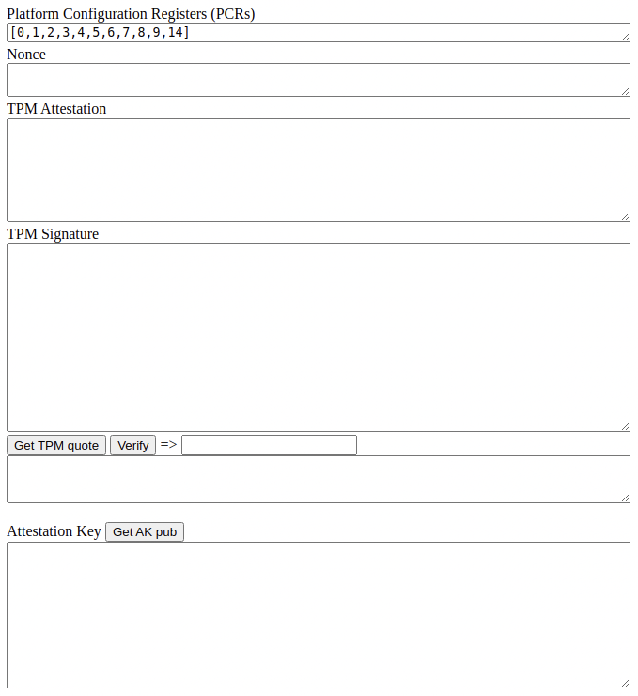
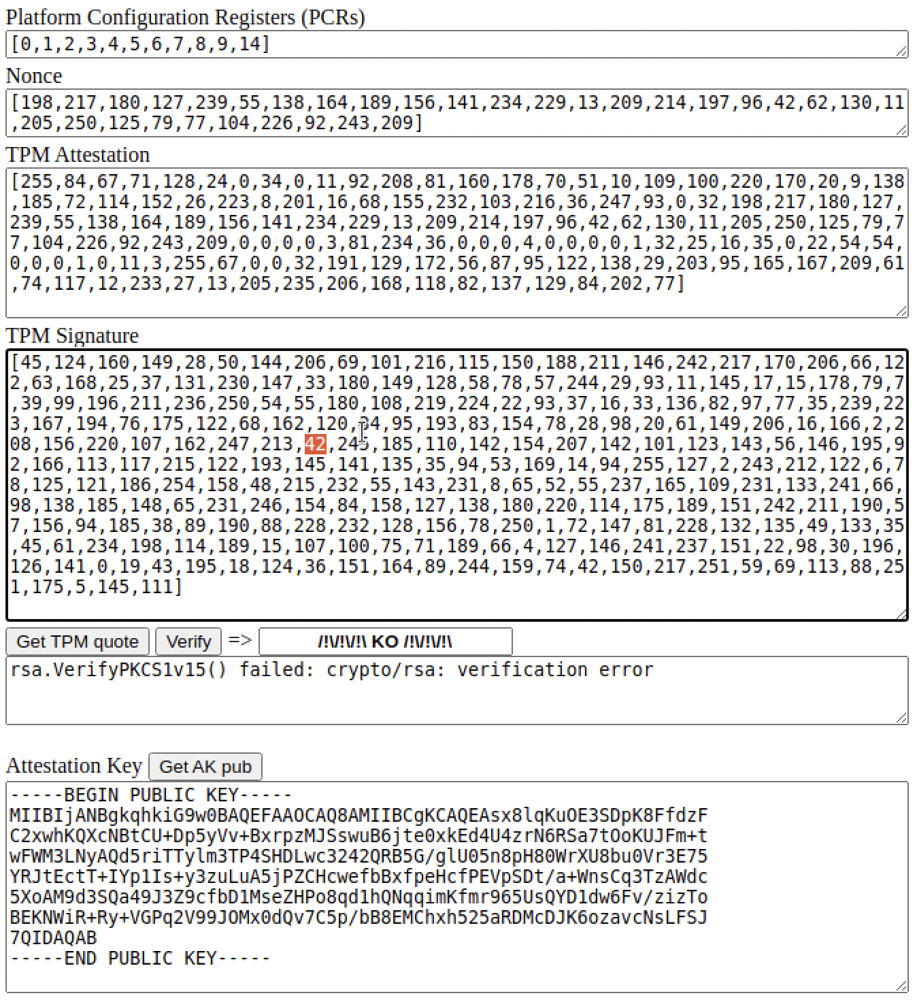
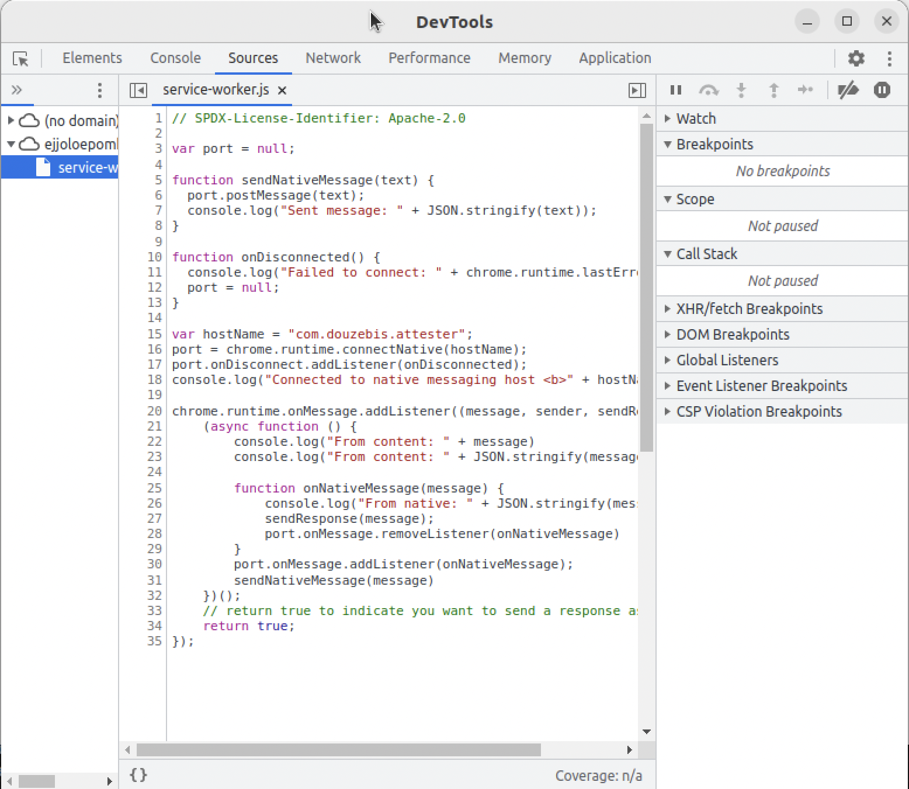

# tpm2-attester

`tpm2-attester` is proof of concept experimenting with performing **TPM remote attestation through the browser**.

Typically a [Remote Attestation framework](https://nedmsmith.github.io/draft-sh-rats-oidc-attest/draft-sh-rats-oidcatt.html) will involve some kind of Authorization Server (AS) reaching back to an Attester endpoint (RA), to retrieve Attestation Evidence.

If implemented as an enhancement to the OIDC code authorization protocol, this mechanism would leverage the User Agent (UA) - the browser on the user's terminal - acting in the capacity of the Attester.

The question becomes: can the browser window (presumably downloaded from the Authorization Server) actually interact with the TPM device on the user's terminal, for retrieving the Attestation Evidence. This is not so easy because typical browsers do not currently support TPM integration (as opposed to FIDO2/Webauthn integration which they support).

This tutorial shows a possible implementation, leveraging an Attester daemon running on the user's terminal:
- The Attester daemon caters for the interaction with the TPM device
- The "authentication" window in the user's browser communicate with the Attester daemon via some browser-extension glue

## Browser / Attester Daemon Glue

The design for glueing browser and daemon consists of:
- The "authentication" window in the user's browser shares its DOM with Javascript code injected by a browser extension[^1], which enables communication via DOM events.
- The injected Javascript code communicates with the extension's service-worker via the [Message Passing API](https://developer.chrome.com/docs/extensions/mv3/messaging/).
- The extension's service-worker communicates with the Attester daemon via the [Native Messaging API](https://developer.chrome.com/docs/extensions/mv3/nativeMessaging/)[^2].

[^1]: The browser extension has to be installed in the user's terminal in the first place.
[^2]: For the extension service-worker to native daemon communication, I have heavily borrowed from [John Farley's mini-project on Github](https://github.com/jfarleyx/chrome-native-messaging-golang).

## Assets used for the Demo

- Ubuntu-desktop guest OS with virtual TPM and measured boot support
- *Non-sandboxed* Chromium browser[^2]
- Golang code for driving the TPM device (adapted from [tpm2-lc](https://github.com/douzebis/tpm2-lc))

[^2]: Sandboxed browsers - such as the SNAP'ed version of chromium or firefox bundled with Ubuntu installation packages - prevent the Native Messaging API from working.

## Installation

### Ubuntu-desktop physical or virtual machine

The tutorial has been tested on:
- [jammy-desktop-arm64](https://cdimage.ubuntu.com/jammy/daily-live/current/jammy-desktop-arm64.iso) (22.04 LTS),
- Ubuntu 23.04 ARM64,
- Ubuntu 23.04 AMD64.

It will run on a physical machine, with the assumption that the `/dev/tpmrm0` device is present. 

Alternatively it will run on a virtual machine prepared as described in [the swtpm section](./swtpm/README.md).

***/!\ If you are using the virtual machine setup, don't forget to launch the `swtpm` device before you boot the Guest OS.***

### Browsers
Typical `chrome` installation should work out of the box.
If you need to use `chromium` or `firefox`, a custom installation is required. This is explained in [the browsers section](./browsers/README.md)

### Golang >= 1.19

The Golang code for driving the TPM requires Golang 1.19, which is not installed by default with Ubuntu 22.04.

Install a more recent version as described by [techadmin.net](https://tecadmin.net/how-to-install-go-on-ubuntu-20-04/)
```bash
wget  https://go.dev/dl/go1.20.2.linux-arm64.tar.gz 
sudo tar -xvf go1.20.2.linux-arm64.tar.gz
sudo mv go /usr/local
export GOROOT=/usr/local/go
export PATH=/usr/local/go/bin:/usr/local/sbin:/usr/local/bin:/usr/sbin:/usr/bin:/sbin:/bin:/usr/mes:/usr/local/games
go version
```

### Ready the Demo

#### Download and Compile the Needed Executables
```bash
git clone https://github.com/douzebis/tpm2-attester.git
cd tpm2-attester/
(cd device && make)
```

#### TPM Ownership
**/!\ make sure your `$USER` has access to `/dev/tpmrm0` and `/sys/kernel/security/tpm0/binary_bios_measurements`**

Take ownership of the TPM and record the TPM/PCR reference values:
```bash
(cd device && ./init --alsologtostderr -v 5)
```

#### Attester Extension
The demo requires an extension being installed on your browser.

##### Extension installation on chrome or chromium
- open `chrome` or `chromium`
- navigate to `chrome://extensions`
- activate `Developer mode` switch
- click `Load unpacked`
- select the `tpm2-attester/chrome` directory and load the extension

Click on the *service worker* link; it shoud say: `Connected to native messaging host <b>com.douzebis.attester</b>`


##### Extension installation on firefox
- open `firefox`
- navigate to `about:debugging`
- click the `This Firefox` link
- click `Load Temporary Add-on...`
- select the `tpm2-attester/firefox/manifest.json` file and load the extension
- go to `Manage Your Extensions`, then to the management page for the "TPM 2.0 Attester" extesion
- In the `Permissions` tab, make sure the extension can `Access your data for all websites` or `Access your data for http://localhost:8000`

#### HTTP Server
Launch an HTTP server for the "authentication" webpage.
```bash
(cd chrome/ && python3 -m http.server &)
```

## Run the Demo

- In the browser, navigate to `http://localhost:8000/index.html`:

- click `[Get TPM quote]`: the browser window (i.e. the Attester) retrieves a PCR quote from the TPM daemon (the list of `PCRs` and `Nonce` are chosen by the Verifier)

- Click `[Get AK pub]`: the browser window shows the Attestation Key that was registered with the Verifier in a provisioning step

- Click `[Verify]`: the Verifier checks the PCR quote... all good.

- Tamper (say) with the TPM Signature, and click `[Verify]` again... this time the Verifier complains!


## Troubleshooting

If the `index.html` page is not responsive, it may have lost contact with the TPM daemon.

Traces/consoles are available for troubleshooting.

### Injected Javascript

The injected `content.js` Javascript code handles the communication between the `index.html` window and the extension's service worker.
Right-click "Inspect" on the `index.html` window and you get access to the source code and a console.


### Extension service worker
The extension's service worker handles the communication with the TPM daemon.
Navigate to `chrome://extensions` and click on the *service worker* link for the extension; you get access to the source code and a console.


### TPM daemon
The TPM daemon outputs execution logs to `/tmp/`:
```bash
$ tail -f /tmp/chrome-native-host-log.txt 
TRACE: 2023/06/05 22:57:11 main.go:107: Chrome native messaging host started. Native byte order: LittleEndian.
TRACE: 2023/06/05 22:57:11 main.go:117: IO buffer reader created with buffer size of 8192.
127.0.0.1 - - [05/Jun/2023 22:57:23] "GET /index.html HTTP/1.1" 304 -
TRACE: 2023/06/05 22:57:27 main.go:127: Message size in bytes: 22
TRACE: 2023/06/05 22:57:27 main.go:163: Message received: {"query":"get-ak-pub"}
TRACE: 2023/06/05 22:57:27 output.go:61: Read Verifier/ak.pub
TRACE: 2023/06/05 22:57:27 output.go:70: publicKeyPEM: [45 45 45 45 45 66 69 71 73 78 32 80 85 66 76 73 67 32 75 69 89 45 45 45 45 45 10 77 73 73 66 73 106 65 78 66 103 107 113 104 107 105 71 57 119 48 66 65 81 69 70 65 65 79 67 65 81 56 65 77 73 73 66 67 103 75 67 65 81 69 65 117 55 100 77 79 70 74 69 117 116 85 43 76 98 66 52 47 51 77 78 10 113 82 87 103 113 57 109 118 105 78 110 107 106 104 65 115 110 84 99 66 121 51 113 66 70 120 117 107 74 80 67 112 102 118 78 83 86 121 86 43 86 75 85 48 76 108 117 101 109 87 113 121 52 120 90 107 52 74 53 79 102 84 47 105 10 101 57 114 112 88 55 87 90 105 81 65 105 82 121 104 85 73 69 82 109 102 72 108 118 117 117 75 104 107 115 70 69 54 52 69 103 47 55 70 71 98 112 75 110 119 81 87 83 119 101 48 74 122 54 122 90 101 110 89 71 76 51 54 112 10 113 100 120 82 97 97 108 47 116 70 85 49 112 68 79 111 48 66 55 90 75 87 75 52 108 97 99 110 69 74 118 66 118 85 110 118 99 70 73 55 71 107 70 117 108 43 68 117 112 112 117 112 72 55 55 65 122 105 77 78 114 80 116 110 10 67 43 116 118 56 55 76 56 115 55 48 90 112 80 97 116 72 55 74 119 83 84 43 78 119 114 85 82 68 100 43 73 55 67 78 85 55 49 97 72 52 69 56 102 109 99 113 71 70 66 110 51 107 52 69 70 67 87 55 65 55 101 72 78 10 106 67 55 84 69 98 103 49 51 102 97 104 110 76 79 48 56 74 73 80 55 116 85 88 82 52 69 89 114 82 105 106 81 69 53 108 85 66 71 90 117 53 48 99 104 120 48 67 57 109 114 57 79 49 77 104 52 116 101 106 54 102 105 113 10 117 81 73 68 65 81 65 66 10 45 45 45 45 45 69 78 68 32 80 85 66 76 73 67 32 75 69 89 45 45 45 45 45 10]
```