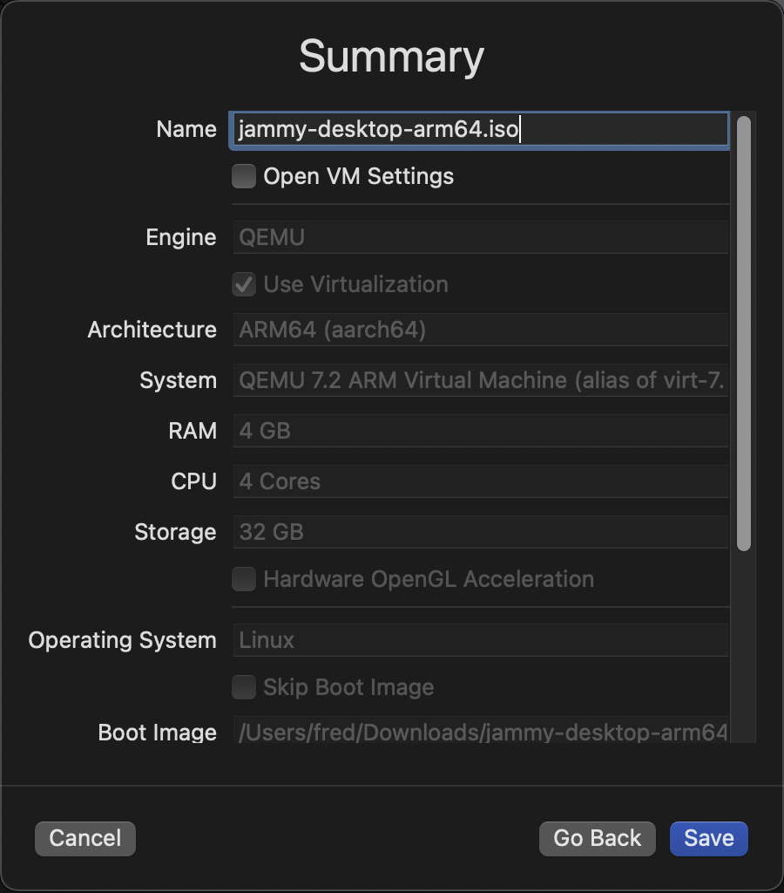
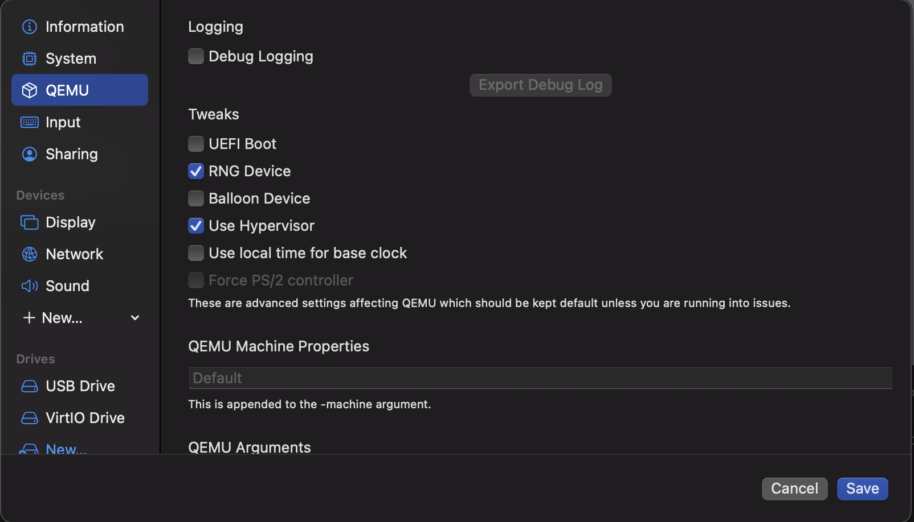
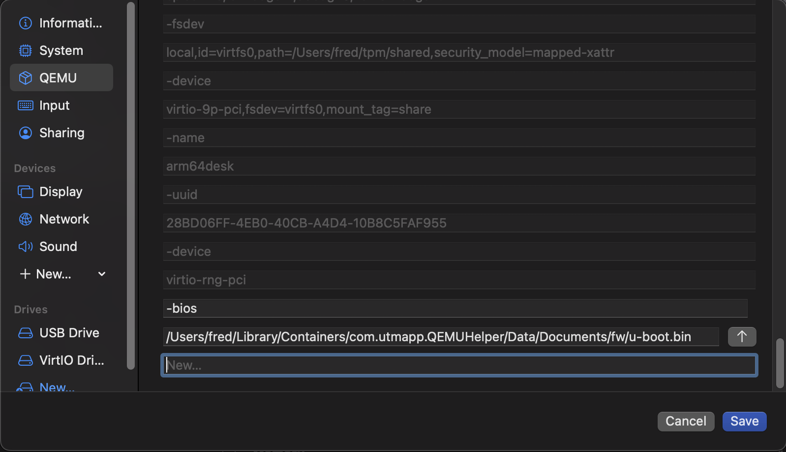
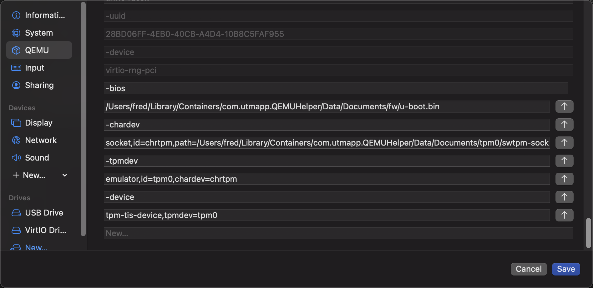
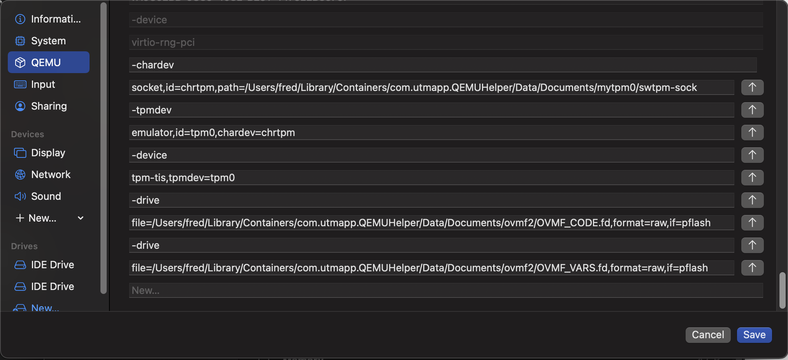

# Software TPM for a Virtual Machine

Here is some help if you're aiming at setting up a virtual machine with Ubuntu guest OS and TPM support.

Specifics for this tutorial:
- Host machine: Mac M1 (macOS Monterey)
- Hypervisor: [UTM](https://mac.getutm.app/) (QEMU under the hood)
- Guest OS:
  - Ubuntu `jammy-desktop-arm64.iso`
  - Ubuntu `jammy-desktop-amd64.iso` (works but way too slow in AMD64 emulation mode)
- UEFI BIOS:
  - [U-Boot](https://packages.ubuntu.com/mantic/all/u-boot-qemu/filelist) for ARM64 architecture
  - [OVMF](https://packages.ubuntu.com/focal/all/ovmf/filelist) for AMD64 architecture

At the end of the tutorial, you get an Ubuntu desktop, where (say) the [tpm2-tools](https://github.com/tpm2-software/tpm2-tools) run as expected.

Notes:
- `swtpm` is an emulation of a real TPM at the "character device" level. Instances of `swtpm` will run on the host OS and you configure them to listen behind a socket or a character device; they maintain their state in a dedicated directory; they can be launched in a terminal window or as a daemon.
- If you need Linux [Integrity Measurement Architecture](https://sourceforge.net/p/linux-ima/wiki/Home/) (IMA) support, it is necessary to replace UTM's default BIOS with an UEFI BIOS compatible with [SHIM and GRUB](https://askubuntu.com/a/342382), otherwise you won't be able to get access to the TPM event log or proper boot measurements.
- The setup described in this tutorial is useful for development but it is not recommended to deploy it in production where a hardware TPM should be used.

## Installation

### UTM/QEMU Hypervisor
Get the DMG at [mac.getutm.app](https://mac.getutm.app/) and install it on the Mac host.

### Ubuntu Image ISO and Install

You can download a "recent" Ubuntu Jammy desktop image at [cdimage.ubuntu.com](https://cdimage.ubuntu.com/jammy)  (server will also work):
- [jammy-desktop-arm64.iso](https://cdimage.ubuntu.com/jammy/daily-live/current/jammy-desktop-arm64.iso) for ARM64 architecture
- [jammy-desktop-amd64.iso](https://cdimage.ubuntu.com/jammy/daily-live/current/jammy-desktop-amd64.iso) for AMD64 architecture



Install the image and boot it.

### Replace the Default BIOS with U-Boot

This step is required so that the (UEFI) BIOS correctly transmits the boot event log to the SHIM / GRUB / Linux layers.

#### ARM64

For ARM64 architecture, use U-Boot.

Retrieve the U-Boot BIOS files from the guest machine. They are part of the `u-boot-qemu` package:
```bash
sudo apt-get install u-boot-qemu
```

The files of interest is `u-boot.bin`. Copy it on the host into a directory where UTM/QEMU can find it: 
```zsh
mkdir -p ~/Library/Containers/com.utmapp.QEMUHelper/Data/Documents/fw
scp guestos:/usr/lib/u-boot/qemu_arm64/u-boot.bin ~/Library/Containers/com.utmapp.QEMUHelper/Data/Documents/fw
```

Shutdown the VM and open UTM's QEMU configuration tab. Deselect the "UEFI Boot" checkbox (we don't want UTM's default BIOS).


Add following two lines at the end of the list of QEMU arguments (adjust paths as needed):
```
-bios
/Users/fred/Library/Containers/com.utmapp.QEMUHelper/Data/Documents/fw/u-boot.bin
```


Boot the VM and check that U-Boot is working OK.

#### AMD64

For AMD64 architecture, use OVMF.

Retrieve the OVMF BIOS files from the guest machine. They are part of the `u-boot-qemu` package:
```bash
sudo apt-get install ovmf
```

The files of interest `OVMF_CODE.fd` and `OVMF_VARS.fd`. Copy them on the host into a directory where UTM/QEMU can find them: 
```zsh
mkdir -p ~/Library/Containers/com.utmapp.QEMUHelper/Data/Documents/fw
scp guestos:/usr/share/OVMF/OVMF_VARS.fd ~/Library/Containers/com.utmapp.QEMUHelper/Data/Documents/fwscp guestos:/usr/share/OVMF/OVMF_CODE.fd ~/Library/Containers/com.utmapp.QEMUHelper/Data/Documents/fw
```

Shutdown the VM and open UTM's QEMU configuration tab. Deselect the "UEFI Boot" checkbox (we don't want UTM's default BIOS).


Add following four lines at the end of the list of QEMU arguments (adjust paths as needed):
```
-drive
file=/Users/fred/Library/Containers/com.utmapp.QEMUHelper/Data/Documents/ovmf2/OVMF_CODE.fd,format=raw,if=pflash
-drive
file=/Users/fred/Library/Containers/com.utmapp.QEMUHelper/Data/Documents/ovmf2/OVMF_VARS.fd,format=raw,if=pflash
```

Boot the VM and check that OVMF is working OK.

#### Additional Resources

- https://wiki.freebsd.org/arm64/QEMU
- https://packages.ubuntu.com/mantic/all/u-boot-qemu/filelist
- https://github.com/tompreston/qemu-ovmf-swtpm
- https://packages.ubuntu.com/focal/all/ovmf/filelist

### Software TPM

Install `swtpm` on the host:
```zsh
brew install swtpm
```

Create an instance of software TPM device:
```zsh
mkdir -p ~/Library/Containers/com.utmapp.QEMUHelper/Data/Documents/tpm0
swtpm_setup --tpmstate ~/Library/Containers/com.utmapp.QEMUHelper/Data/Documents/tpm0 --createek --tpm2
```

`swtpm` displays information about the created device:
```
Starting vTPM manufacturing as fred:staff @ Tue 30 May 2023 10:41:56 PM CEST
TPM is listening on Unix socket.
Successfully created RSA 2048 EK with handle 0x81010001.
Successfully created ECC EK with handle 0x81010016.
Successfully activated PCR banks sha256 among sha1,sha256,sha384,sha512.
Successfully authored TPM state.
Ending vTPM manufacturing @ Tue 30 May 2023 10:41:56 PM CEST
```

Launch the software TPM device:
```zsh
swtpm socket --tpmstate dir=/Users/fred/Library/Containers/com.utmapp.QEMUHelper/Data/Documents/tpm0 --ctrl type=unixio,path=/Users/fred/Library/Containers/com.utmapp.QEMUHelper/Data/Documents/tpm0/swtpm-sock --log level=20 --tpm2
```

(Alternatively, `swtpm` can be launched as a daemon. For example with the following options: `--log file=xxx,level=20 -d`)

#### Additional Resources
- https://tpm2-software.github.io/2020/10/19/TPM2-Device-Emulation-With-QEMU.html
- https://github.com/stefanberger/swtpm/issues/4#issuecomment-385998296
- https://github.com/stefanberger/swtpm/issues/4#issuecomment-385998296
- https://www.linaro.org/blog/how-to-emulate-trusted-platform-module-in-qemu-with-u-boot/
- https://gist.github.com/oznu/ac9efae7c24fd1f37f1d933254587aa4

### Configure UTM for using the Software TPM

### ARM64

Shutdown the VM and open UTM's QEMU configuration tab; add the following six lines at the end of the list of QEMU arguments:

```
-chardev
socket,id=chrtpm,path=/Users/fred/Library/Containers/com.utmapp.QEMUHelper/Data/Documents/tpm0/swtpm-sock
-tpmdev
emulator,id=tpm0,chardev=chrtpm
-device
tpm-tis-device,tpmdev=tpm0
```


Boot the VM and check the software TPM is working OK. For example, try the following commands:
``` bash
sudo apt-get install tpm2-tools
sudo tpm2_pcrread
sudo tpm2_eventlog /sys/kernel/security/tpm0/binary_bios_measurements
```

### AMD64

Shutdown the VM and open UTM's QEMU configuration tab; add the following six lines at the end of the list of QEMU arguments:

```
-chardev
socket,id=chrtpm,path=/Users/fred/Library/Containers/com.utmapp.QEMUHelper/Data/Documents/tpm0/swtpm-sock
-tpmdev
emulator,id=tpm0,chardev=chrtpm
-device
tpm-tis,tpmdev=tpm0
```


Boot the VM and check the software TPM is working OK. For example, try the following commands:
``` bash
sudo apt-get install tpm2-tools
sudo tpm2_pcrread
sudo tpm2_eventlog /sys/kernel/security/tpm0/binary_bios_measurements
```
